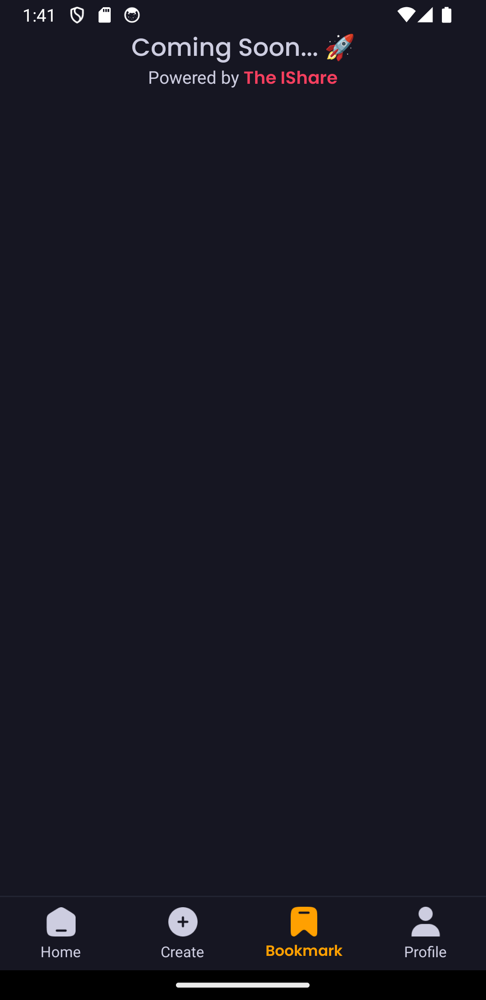

# IShare the (Video Sharing) Platform

## Description

IShare is a video sharing platform that allows users to upload, share, and view videos. Users can create an account, upload videos, and view videos uploaded by other users. The platform also allows users to like and comment on videos. IShare is built using React Native, AppWrite and for styling, we have used Tailwind CSS.

## Features

- User Authentication
- Video Upload
- Video Viewing
- Like and Comment on Videos
- Share Videos with other users on the platform or on other social media platforms like WhatsApp, Facebook, etc.
- Comment on Videos
- Like and Dislike Videos
- Follow and Unfollow Users on the Platform to get notified when they upload new videos or go live.

## Technologies

- React Native
- AppWrite
- Tailwind CSS

## Installation

1. Clone the repository

```bash
   git clone https://github.com/Rajkumar-Khatua/IShare-React-Native-.git
```

2. Install dependencies

```bash
npm install
```

3. Start the application

```bash
npx expo start -c
```


## Want to Contribute?

To start contributing, follow the below guidelines:

- Fork the repository and clone it locally.
- Create a new branch for your changes.
- Make your changes to the code.
- Add your name to the contributors' list.
- Create a pull request.
- Star the repository.

This is Very good project to start your React Native journey. You can contribute to this project and make it better. If you have any questions, feel free to ask.
You can contact me on
[Twitter](https://twitter.com/RajkumarKh18976)
[Linkedin](https://www.linkedin.com/in/rajkumarkhatua/)

## Features are Not Implemented Yet but you can contribute to this project and make it better.

- BookMark Screen
  
- Like DisLike
- Comment on Videos
- Share function
- Profile Edit
- Profile Picture Upload
- Video Upload Progress Bar
- Video Upload Cancel Button
- Share Button it should add in every videos and user can share the video link to other social media platform.
- Video Player Screen should be more interactive. User can see the video title, description, like, dislike, comment, share button. User can also see the video uploader name and profile picture. User can also see the video upload date and time. User can also see the video view count.
- User can also see the video uploader profile. User can see the video uploader name, profile picture, total video uploaded, total followers, total following, total like, total dislike, total comment, total share, total view count.
- User can also see the video uploader bio, website, social media links.
- User can also see the video uploader followers and following list.
- User can also see the video uploader liked videos, disliked videos, commented videos, shared videos, bookmarked videos.

## Contributors

- [Rajkumar Khatua](https://www.linkedin.com/in/rajkumarkhatua/)

## Acknowledgements

- Thanks to JsMastery (https://www.youtube.com/@javascriptmastery) for guide me to build this project.
- A big thanks to [Appwrite](https://appwrite.io/) for providing the backend services for this project.
- A big thanks to [Tailwind CSS](https://tailwindcss.com/) for providing the styling for this project.
- A big thanks to [React Native and Expo]
  (https://reactnative.dev/) (https://expo.dev/) for providing the frontend services for this project.
